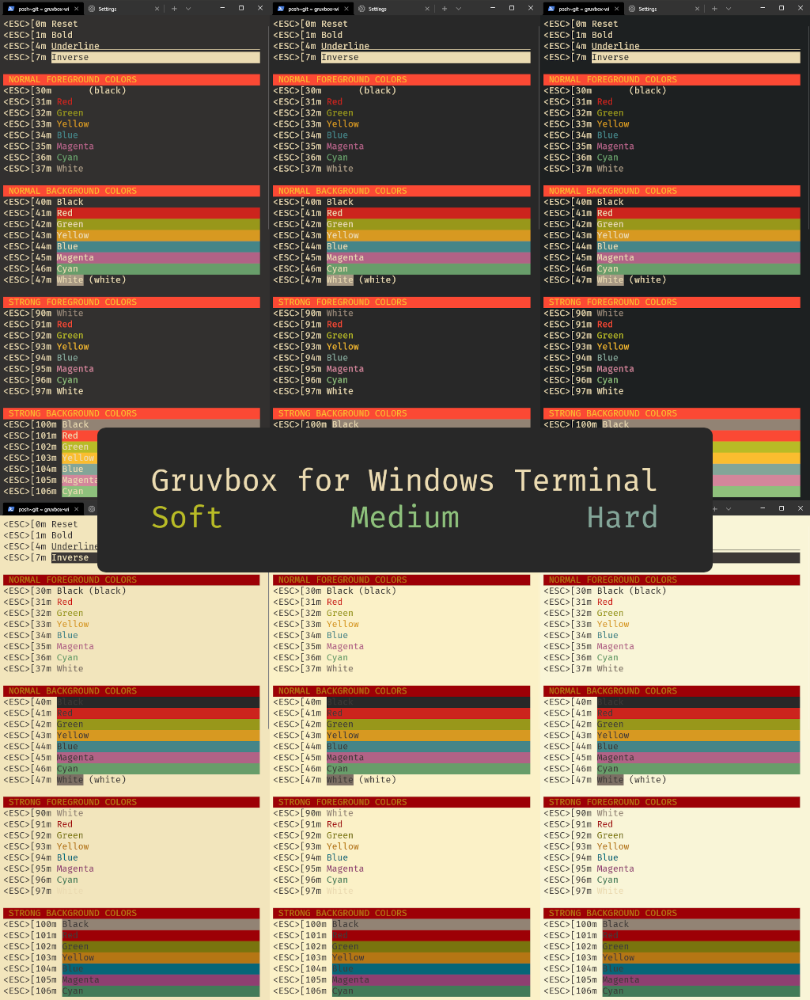

# Gruvbox theme for Windows Terminal

####Moved From [here](https://github.com/ZeusOfTheCrows/gruvbox-windows-terminal)

A collection of [gruvbox](https://github.com/gruvbox-community/gruvbox) themes for windows terminal, originally by [russdb](https://github.com/russdb/gruvbox-windows-terminal)

### Install  (I hope this will be easier in future):

 * Open Windows Terminal
 * Open settings (Ctrl+,)
 * Click Open JSON file (bottom left)
 * Search for '"schemes":'
 * Copy the contents of gruvbox_light or gruvbox_dark (or both) to inside the square brackets (WT should organise them automatically)
 * In WT settings, choose the profile you use (cmd, ps, etc.), go to the appearance tab, and choose your preferred colour scheme

### To check install:

* Run colour_test.bat (sourced from [here](https://gist.githubusercontent.com/mlocati/fdabcaeb8071d5c75a2d51712db24011/raw/b710612d6320df7e146508094e84b92b34c77d48/win10colors.cmd))

### Preview:

​	(Font is [Fira Code](https://github.com/tonsky/FiraCode))

